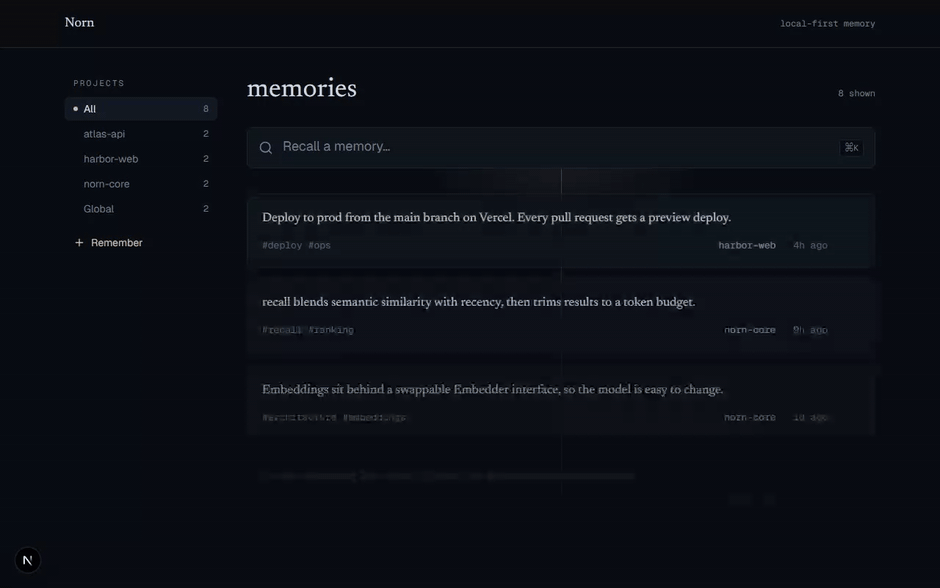
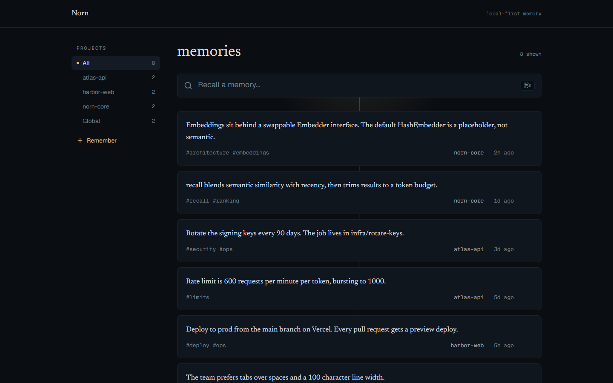

# Norn

Persistent, visible memory for AI coding agents.

**[Live site](https://norn-web-three.vercel.app)** · [Releases](https://github.com/samad001z/Norn/releases) · [Quickstart](#quickstart) · [Connect your AI tool](docs/connecting.md)



Your AI forgets you every session. Norn is a local MCP server that remembers your
decisions, preferences, and project context across every session and project, for
Claude Code, Cursor, and any MCP client. Unlike most memory tools it is fully local
and fully inspectable: a dashboard lets you see exactly what it stored and forget
anything you do not want.

## Quickstart

**What you need:** just **Node.js 20 or newer** — you don't install Norn separately,
the command below fetches it automatically. Check with `node --version`; if it's
missing or below v20, grab the LTS from [nodejs.org](https://nodejs.org).

**Connect to Claude Code** — one command, no clone:

```bash
claude mcp add norn -- npx -y @samad001z/norn-server
```

**Or use the CLI in your terminal** — run it on demand, or install the `norn` command:

```bash
npx @samad001z/norn-core list           # no install — npx fetches it each time
npm install -g @samad001z/norn-core     # or put the `norn` command on your PATH
```

**Any other MCP client** — add this to its MCP config:

```json
{
  "mcpServers": {
    "norn": {
      "command": "npx",
      "args": ["-y", "@samad001z/norn-server"]
    }
  }
}
```

Restart your tool. Norn registers four tools: `remember`, `recall`, `forget`, `list`.

> **Optional — flag possible conflicts:** add `"env": { "NORN_DETECT_CONFLICTS": "1" }`
> to the config above and Norn will surface memories that might disagree, for you to
> resolve in the dashboard. Off by default; it downloads a small extra model the first
> time it finds a candidate, and it never changes your store on its own.

> **Not sure where that config goes?** The **[Connect Norn to your AI tool](docs/connecting.md)**
> guide has exact, copy-paste setup for Claude Desktop, Cursor, Windsurf,
> VS Code + GitHub Copilot, and Gemini CLI — plus a beginner "what you need" and
> troubleshooting. (VS Code + Copilot uses a `servers` key instead of `mcpServers`.)

**Verify it's connected:** tell your assistant *"Remember that I prefer pnpm over
npm,"* then in a new chat ask *"What package manager do I prefer?"* — it should answer
**pnpm** by calling Norn's `recall` tool.

> The first `remember` or `recall` downloads a local embedding model
> (all-MiniLM-L6-v2, ~25 MB) once, then runs fully offline.

<details>
<summary>Or run from source</summary>

```bash
git clone https://github.com/samad001z/Norn.git
cd Norn
npm install
npm run build -w @samad001z/norn-core && npm run build -w @samad001z/norn-server
claude mcp add norn -- node "$(pwd)/server/dist/index.js"
```

</details>

## See it work

Memory survives across sessions, and recall is semantic: it matches meaning, not
keywords.

**Session 1**

> You: Remember that we deploy to production from the main branch on Vercel.
>
> Claude calls `remember("deploy to production from the main branch on Vercel", project: "acme")`

**Session 2, the next day, in a fresh context window**

> You: How do we ship to prod?
>
> Claude calls `recall("how do we ship to prod")`
>
> Norn returns "Deploy to production from the main branch on Vercel." even though the
> query shares no keywords with the stored note.

## Using memory: it's explicit, not automatic

Norn does **not** record your sessions. It is a memory store, not a logger — it never
silently captures your prompts, code edits, or terminal commands. A memory exists only
when the agent calls `remember()`, which happens in two ways:

- **You ask for it.** *"Remember that we deploy from `main` on Vercel."* The agent calls
  `remember(...)` and the note is saved.
- **The agent chooses to**, when it judges a fact worth keeping for next session — a
  decision, a preference, a constraint.

That is the point: **you decide what's kept**, so the store stays signal, not noise. The
flip side is that **if you never ask, nothing is saved** — so a sparse dashboard after a
long working session is expected, not a bug. The work itself lives in git; Norn is for the
durable facts you want recalled later.

A few habits that make it pay off:

- End a task with **"remember the key decisions from this"** and the agent writes them down.
- Front-load context once — **"remember my stack and conventions"** — instead of
  re-pasting it every session.
- Ask **"what do you remember about X?"** to make the agent call `recall()` on demand.

Everything saved this way shows up in the dashboard, and you can forget any of it.

## How it works

Three local pieces share one local database:

```
Claude Code / Cursor  ──MCP (stdio)──►  Norn MCP server  ┐
                                                          ├──►  ~/.norn/norn.db
        Dashboard (Next.js)  ────────────────────────────┘     (SQLite + sqlite-vec)
```

- **MCP server** (`/server`): exposes `remember`, `recall`, `forget`, `list` over stdio.
- **Store** (`/core`): SQLite + sqlite-vec, with embeddings from a local MiniLM model
  (no API key). `recall` blends semantic similarity with recency and trims results to a
  token budget; `remember` dedupes near-identical notes.
- **Dashboard** (`/web`): a Next.js app to browse and manage everything.

All three resolve to the same store, so a memory written by your agent appears in the
dashboard, and a memory you forget in the dashboard is gone for the agent too. The store
is chosen in this order:

1. `NORN_DB_PATH`, if set — an explicit override always wins.
2. The nearest **project-local** `.norn/norn.db`, walking up from the working directory
   (see [Per-project memory](#per-project-memory)).
3. The global `~/.norn/norn.db`.

With no project store and no override, this is the original behavior: one global
`~/.norn/norn.db`.

## Per-project memory

Give a repo its own memory that ships with it. From the project root:

```bash
npx @samad001z/norn-core init   # or: norn init
```

This creates a `.norn/` directory holding that project's `norn.db`. Because each project
has its own database file, **memories never bleed across projects**: an agent working in
one repo only sees that repo's memory.

### How a project is detected

Norn finds your project the way git does — by walking **up** from the working directory
to the nearest ancestor that contains a `.norn/` directory. Run your agent (or the CLI)
anywhere inside the repo and it resolves to the same store. The store is chosen in this
order:

1. **`NORN_DB_PATH`**, if set — an explicit override always wins.
2. The nearest **project-local** `.norn/norn.db`, walking up from the working directory.
3. The global **`~/.norn/norn.db`** — the original behavior when no project store exists.

Even without `norn init`, projects stay isolated in the shared global store: every memory
is stamped with the project root it was written under (a `scope`, derived from the nearest
`.git`/`.norn` ancestor — distinct from the freeform project label), and recall only
returns the current project's memories plus global ones. Separate db files are the primary
isolation; the scope stamp is defense in depth for the shared store.

### Commit memory with the repo

> `norn export` / `norn import` are available from **v1.1 onward**. On earlier versions,
> commit the binary `norn.db` directly (the default `norn init` setup).

`norn.db` is a binary SQLite file — it holds embedding vectors, so it has no readable git
diffs and can conflict on merge. To version your memory cleanly, commit a **diffable text
export** instead and let each checkout rebuild its own database:

```bash
norn export   # writes .norn/memory.json — text, tags, project, ids, timestamps (no vectors)
```

`memory.json` is sorted deterministically, so re-exporting an unchanged store produces an
empty diff. Embeddings are **not** stored in it; they are regenerated locally on import, so
the file stays small and review-friendly. Commit it and gitignore the binary store with a
`.norn/.gitignore` like:

```gitignore
# .norn/.gitignore — commit memory.json, ignore the binary store.
# norn.db is binary SQLite (it holds embedding vectors): no readable diffs,
# and it can conflict on merge. memory.json (not listed here) is the
# diffable file you commit; the sidecars below are always transient.
norn.db
norn.db-wal
norn.db-shm
norn.db-journal
```

> `norn init` (v1.1+) writes exactly this `.gitignore` for you, so `memory.json` is the
> committed artifact out of the box. Prefer to commit the binary `norn.db` instead — no
> import step on clone, at the cost of readable diffs? Just delete the `norn.db` line.

On a fresh clone, rebuild the local database from the committed file:

```bash
norn import   # reads .norn/memory.json and regenerates embeddings locally
```

`import` upserts by id, so it is safe to re-run; it never duplicates a memory.

### Try it: isolation, then commit-and-clone

A self-contained, copy-paste walkthrough (uses `npx`, no install; needs Node 20+ and git):

```bash
# 1. Two separate projects, each with its own committed memory store.
mkdir -p /tmp/demo/alpha /tmp/demo/beta

cd /tmp/demo/alpha
npx @samad001z/norn-core init
npx @samad001z/norn-core remember "Alpha API rate limit is 600 requests per minute per token"

cd /tmp/demo/beta
npx @samad001z/norn-core init
npx @samad001z/norn-core remember "Beta deploys to prod from the main branch on Vercel"

# 2. Isolation: from Beta, ask for Alpha's fact. Beta only ever returns its own
#    (and global) memories — Alpha's note never appears here.
npx @samad001z/norn-core recall "what is the request rate limit"

# 3. Export Alpha's memory to a diffable file and commit it.
cd /tmp/demo/alpha
npx @samad001z/norn-core export                       # writes .norn/memory.json
git init -q && git add .norn/memory.json && git commit -qm "Add project memory"

# 4. Simulate a teammate's fresh clone: bring the export, NOT the binary db.
mkdir -p /tmp/demo/alpha-clone/.norn
cp .norn/memory.json /tmp/demo/alpha-clone/.norn/memory.json

# 5. Rebuild the store from the committed file and confirm recall works.
cd /tmp/demo/alpha-clone
npx @samad001z/norn-core import                       # regenerates embeddings locally
npx @samad001z/norn-core recall "what is the request rate limit"
#   → "Alpha API rate limit is 600 requests per minute per token"
```

## Features

- **Remembers across sessions and projects.** Stop re-pasting CLAUDE.md by hand.
- **See everything it knows.** No black box: every memory is visible.
- **Forget anything, with undo.** Full control over what it keeps.
- **Surfaces stale memories.** Memories you haven't touched in a while are quietly
  flagged in the dashboard so you can prune them. It surfaces — it never deletes.
- **Possible-conflict detection (opt-in).** Set `NORN_DETECT_CONFLICTS=1` and Norn
  flags memories that might disagree so you choose which to keep — it never
  auto-resolves, edits, or deletes. Off by default; the extra model only downloads
  once you turn it on.
- **Lives in your tools over MCP.** Claude Code, Cursor, and any MCP client.
- **Local-first.** Your context, the embedding model, and the database all stay on your
  machine.

## Privacy

Local by default. The store is a SQLite file on your disk, the embedding model runs on
your machine, and nothing leaves it: no account, no API key, no telemetry. Delete
`~/.norn/norn.db` and the memory is gone.

## Manage your memories

The dashboard lets you browse by project, search, and forget any memory (with undo).
It runs from a clone of this repo (it is not part of the `npx` server package), and it
reads the same local store your agent writes to — `~/.norn/norn.db` — so whatever Norn
remembered shows up here.

Run these four commands from a fresh terminal:

```bash
git clone https://github.com/samad001z/Norn.git
cd Norn
npm install          # install dependencies
npm run build:core   # build the store package the dashboard reads through (required)
npm run dev:web      # start the dashboard
```

Then open **http://localhost:3000/app**.

> Skipping `npm run build:core` is the usual reason the dashboard opens empty: the web
> app imports the compiled store from `@samad001z/norn-core`, so that package has to be
> built once first. After that, `npm run dev:web` is all you need to reopen it.

To point the dashboard at a store in a non-default location, set `NORN_DB_PATH` to the
same path your agent uses before running `dev:web` (otherwise the default is fine):

```bash
NORN_DB_PATH=/path/to/norn.db npm run dev:web
```



Prefer the terminal? Inspect the same store without the dashboard:

```bash
npm run cli -w @samad001z/norn-core -- init    # give this project its own committed store
npm run cli -w @samad001z/norn-core -- list
npm run cli -w @samad001z/norn-core -- recall "how do we deploy"
npm run cli -w @samad001z/norn-core -- export  # write .norn/memory.json to commit with the repo
npm run cli -w @samad001z/norn-core -- import  # rebuild this checkout's store from memory.json
```

## Roadmap

- Swappable embedding backends (Ollama, OpenAI-compatible) behind the existing `Embedder`
  interface.
- Edit memories in place from the dashboard (adding and forgetting already work).
- A larger labelled benchmark for conflict detection, to tune the thresholds with more data.
- More editor and MCP-client integrations.

## Contributing

Contributions are welcome. See [CONTRIBUTING.md](CONTRIBUTING.md). The short version:

```bash
npm install
npm run build
npm test -w @samad001z/norn-core
```

## License

MIT. See [LICENSE](LICENSE).
